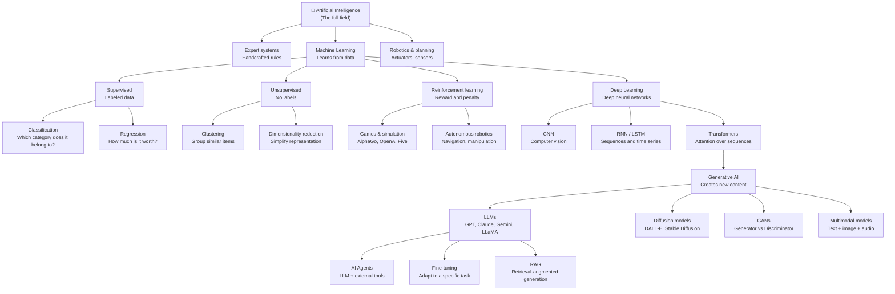

# basic-neuronal-network
# Layers of Artificial Intelligence

Map of subsets and correlations, from most general to most specific.

---

## Hierarchy diagram



---

## Key question per layer

| Layer | Diagnostic question | If the answer is... |
|-------|---------------------|---------------------|
| **AI vs non-AI** | Does the machine reason, learn, or perceive? | Yes → it's AI |
| **Classic AI vs ML** | Does it learn from data or follow fixed rules? | Data → ML · Rules → Classic AI |
| **ML vs Deep Learning** | Does it use networks with many hidden layers? | Yes → DL · No → Classic ML |
| **DL vs Transformer** | Does it need to relate distant parts of the input? | Yes → Transformer · No → CNN/RNN |
| **Generative vs discriminative AI** | Does it create new content or just classify? | Creates → Generative · Classifies → Discriminative |
| **LLM vs Agent** | Can it use external tools (APIs, code execution)? | Yes → Agent · No → Base LLM |

---

## Analogies to remember

| Concept | Analogy |
|---------|---------|
| **AI** | The concept of "vehicle" — includes cars, trains, planes |
| **ML** | Teaching by example, without giving explicit definitions |
| **Deep Learning** | Peeling an onion: each layer reveals something more abstract |
| **Transformer** | Reading a book and being able to connect any page to any other |
| **Generative AI** | The difference between a photographer (classifies) and a painter (creates) |
| **LLM** | A chef who read millions of recipes and can invent new dishes |
| **Agent** | An LLM with hands: it can search, calculate, and execute |

---

## Containment relationships

```
AI
└── Machine Learning
    ├── Classic ML (supervised, unsupervised, reinforcement)
    └── Deep Learning
        ├── CNN
        ├── RNN / LSTM
        └── Transformers
            └── Generative AI
                ├── LLMs ──► AI Agents
                ├── Diffusion models
                ├── GANs
                └── Multimodal models
```

> Every LLM is Generative AI. Every Generative AI model is Deep Learning.
> Every Deep Learning model is ML. Every ML model is AI. But not the other way around.
